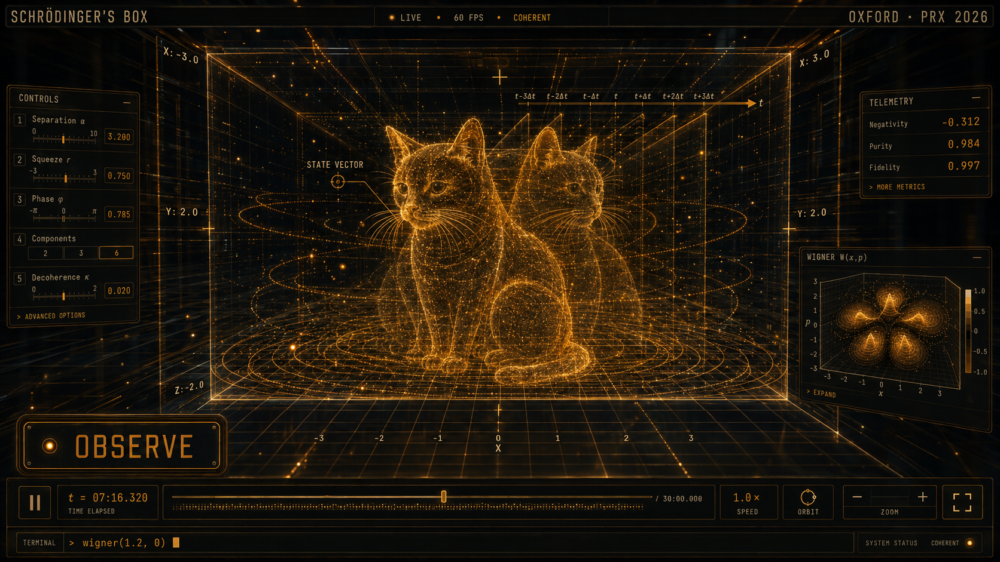

# Schrödinger's Box

> *"To this day, we don't know if our cat (Schrödinger), is alive or dead."* — Elon Musk, 17 Sep 2023

An interactive quantum observation chamber. A cat state lives inside a WebGL box; every number on the page — the Wigner function, negativity, purity, fidelity, photon statistics, and the result you get when you press **OBSERVE** — is computed from the actual state vector. Nothing is typed in.

**Live:** https://osmantechnologies.github.io/schrodingers-box/ — landing page
**The instrument:** https://osmantechnologies.github.io/schrodingers-box/lab.html
**Study log:** https://osmantechnologies.github.io/schrodingers-box/studies.html



## What's real

The state is a coherent-state cat: an equal superposition of *N* coherent states |α<sub>k</sub>⟩ on a ring in phase space, α<sub>k</sub> = α·e<sup>i(2πk/N + φ)</sup>.

| Control | What it does to the state |
|---|---|
| **Separation α** | Ring radius. ⟨n⟩ = α². |
| **Squeeze r** | Applies S(r) to the whole state — a canonical rescaling W(x,p) → W(x·e<sup>r</sup>, p·e<sup>−r</sup>). |
| **Phase φ** | Rotates the ring. When the clock runs, the state also rotates under free evolution H = ħωa<sup>†</sup>a. |
| **Components** | N = 2, 3 or 6. Sixfold symmetry reproduces the Oxford PRX figure. |
| **Decoherence κ** | Damps coherences by e<sup>−0.15κ·\|α<sub>j</sub>−α<sub>k</sub>\|²</sup> — the photon-loss form: distant branches lose their fringes first. |
| **OBSERVE** | Draws one sample from the marginal P(x) = ∫W dp and reports which branch it belongs to. Repeat 200 times and `hist()` converges to P(x). |

Metrics, all numerical integrals over a 96×96 grid (72×72 on phones):

- **Negativity** — ∫<sub>W<0</sub> |W| d²β. Zero for any classical state. For N=2 it converges to 1/π ≈ 0.318, the textbook value.
- **Purity** — Tr ρ² = π ∫W² d²β. Reads 0.9999 at κ=0.
- **Fidelity** — π ∫ W·W<sub>pure</sub> d²β, overlap with the undamped cat.
- **P(n)**, ⟨n⟩, parity — from ψ<sub>n</sub> ∝ Σ<sub>k</sub> α<sub>k</sub><sup>n</sup>e<sup>−|α|²/2</sup>/√n!.

The 3D chamber is illustrative: the cat is a Tripo-generated GLB (`models/schrodinger-cat.glb`, 9 usable parts, 19k tris, no rig) rendered as a hologram — barycentric wireframe + Fresnel shell + baked-texture stripe modulation, with ~7.5k particles sampled once from the real mesh surface (head-weighted). Two full-mesh temporal echoes flank it; deeper echoes are particles only. Breathing, head yaw/pitch (±2°) and tail sway (±3°) are procedural on pivot groups placed from bbox inspection. The readouts are real; the cat is a picture of the readouts.

UI: instrument layout — controls column (Basic / Field / Environment tabs, each slider with a live mini-graph cut from the state), chamber centre, telemetry cards with sparklines + confidence bars (grid-mass and fringe-resolution), Wigner panel with W/P(x)/P(p) tabs and the Fock strip, transport deck with the W(x,p=0) waveform scrubber. Field and Environment sliders drive real uniforms (particle gain, scan rate, echo depth, ring drift, bloom, grain, grid, reflection).

Post chain: RenderPass → UnrealBloom (half-res, threshold 0.8) → ACES tone-map → film pass (grain, vignette, radial chromatic aberration that spikes on collapse). The hologram and particles are mirrored through the floor with a `REFL` shader define so the floor reads as polished glass. Bloom switches off automatically when the adaptive quality tier drops.

`inspect.html?view=front|side|iso&mode=parts|tex` is the model-inspection mode: colours each GLB part, logs the hierarchy, draws the bounding box.

## Terminal

Type `help` in the bottom bar. `psi()` prints the ket. `wigner(x,p)` evaluates W at a point. `hist()` shows your observation histogram. The state is also exposed on `window.__PSI` — `__PSI.tex()` prints it as LaTeX.

## Keys

`Space` play/pause · `O` observe · `Esc` reset / close · drag to orbit · wheel to zoom

## Structure

| File | What it is |
|---|---|
| `index.html` | Landing page — five fullscreen panels: hero chamber, interactive Wigner, field notes, methodology, measurement + CTA. |
| `studies.html` | Study log — six numerical experiments, recomputed in-browser each load, reproducible from a seed. |
| `hardware/` | IBM Quantum submission script + raw counts from real QPU runs (`runs.json`, written only by a real job). |
| `js/studies.js` | The analyses: KS test, Wehrl/Lieb, Mandel Q, Fisher information, Zₙ harmonics, Zurek fringe scaling. |
| `lab.html` | The instrument — full controls, telemetry, Wigner panel, terminal, OBSERVE. |
| `js/physics.js` | Physics core: state, Wigner function, metrics, Born-rule sampling. No DOM. |
| `js/chamber.js` | three.js scene: chamber, hologram cat, particles, reflections, post chain. |
| `assets/land/` | GPT-generated backdrops (ion trap, cat portrait, sealed box, optics bokeh), WebP, screen-blended on black. |
| `vendor/` | three.js r169 + loaders + postprocessing (MIT). |

Both pages import the same two modules, so the numbers on the landing page are computed by exactly the code the lab runs — there is no second implementation and no hardcoded copy.

## Hardware

`hardware/run_ibm.py` prepares GHZ states — the discrete-variable cat — on an IBM Quantum
superconducting QPU and measures populations plus parity oscillations, bounding the GHZ fidelity
from below (`F ≥ (P₀+P₁)/2 + C/2`; `F > ½` certifies genuine multipartite entanglement). The
parity fringe frequency counts the components of the superposition, the hardware analogue of the
phase-space fringe scaling in study S-06. See [`hardware/README.md`](hardware/README.md).

Until a real job has been run, the study page shows an explicit "awaiting run" state. Simulated
data is never substituted for hardware data.

## Deploy

Static site, no build step. Two routes:

**Drag and drop.** `python build-netlify.py` writes `netlify-deploy/` and `netlify-deploy.zip`
(26 files, 4.7 MB; zip 3.4 MB). Drop either onto <https://app.netlify.com/drop>. The zip is written
with Python's `zipfile` using forward-slash paths on purpose — PowerShell's `Compress-Archive`
stores backslashes and every file in a subfolder 404s on Netlify.

**Connect the repo.** Point Netlify at this repository; the root `netlify.toml` publishes `.`
with no build command and sets caching (immutable for `vendor/`, `models/`, `assets/`;
always-revalidate for HTML and `hardware/runs.json`) plus the `model/gltf-binary` type for the cat.

Both artefacts are gitignored — regenerate with `python build-netlify.py`.

## Run locally

Any static server — ES modules won't load over `file://`:

```bash
python -m http.server 8080
```

then open http://localhost:8080. No build step. `vendor/three.module.js` is Three.js r169 (MIT).

## The paper

Saner, Băzăvan, Webb, Araneda, Lucas, Ballance, Srinivas — *Generating Arbitrary Superpositions of Nonclassical Quantum Harmonic Oscillator States*, Phys. Rev. X **16**, 021049 (2026). Oxford's trapped-ion group built superpositions whose components are themselves squeezed, trisqueezed and quadsqueezed, using a mid-circuit measurement to project the ion's motion into the shape they wanted.

> "This approach gave us a tool to sculpt the quantum superposition into almost any shape." — Sebastian Saner

## Licence

MIT. Cat asset generated; Three.js MIT.
